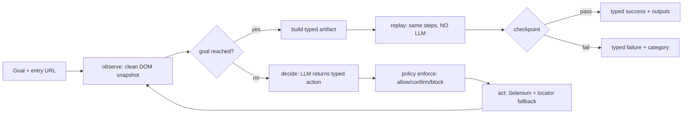

## Architecture

The system is a vertical slice split into five layers, each with one job and one source of truth:

| Layer | Module | Source of truth |
|-------|--------|-----------------|
| Target surface | `src/proxy_app/` (Flask, "MemberServ Console") | Deterministic in-memory seed data |
| Typed contract | `artifact/` (Pydantic models) | `artifact/models.py` -> derived `docs/schemas/artifact.schema.json` |
| Safety core | `safety/` (policy + redaction engine) | `config/policy.json` |
| Discovery (LLM here only) | `discovery/` (observe -> decide -> act loop) | `DiscoveryConfig` + local Ollama `qwen2.5-coder:7b` |
| Replay (no LLM anywhere) | `replay/` (engine, taxonomy, handoff) | `config/taxonomy.json` |

Key trade-offs:

- **Local, text-only LLM.** `qwen2.5-coder:7b` via Ollama costs no API budget and keeps runs offline; being text-only forces observe to emit a clean DOM/accessibility snapshot instead of screenshots, which also keeps prompts small and logs reviewable. The cost is a weaker planner: live runs need a precise goal statement (URL + element names) and a step/time budget.
- **One CLI, two modes of trust.** `discover` may improvise (LLM); `replay` never does (enforced by a static import test over `replay/`). The artifact is the hand-off point between the two.
- **Config over code.** Policy, redaction patterns and failure patterns are JSON files, so an operator retunes guardrails or error vocabulary without a code change.
- **Tests use fakes, evidence uses live runs.** The suite (474 tests) injects a fake LLM and fake driver; `/evidence/` is produced only by real Chrome + Ollama + the proxy app.



## Artifact schema

The artifact is a serializable, versioned (`semver`), typed JSON contract that fully decouples the discovered flow from the LLM history that produced it. Pydantic models are the source of truth; the exported JSON Schema is derived and guarded by an anti-drift test.

- **Identity and intent**: `capability_id` (snake_case), `version`, `description`, `target_app` (`name` + `entry_url`), so a reviewer or calling agent understands the capability from the file alone (see `evidence/artifact_example.json`).
- **Typed IO**: `input_schema` / `output_schema` are constrained JSON-Schema object subsets; cross-invariants are validated on the whole artifact (every `{{input.X}}` declared, every `extract.output_key` declared, `step_id` strictly `1..n`), so drift fails at load time, not at run time.
- **Steps with prioritized locators**: every step carries an ordered `locators` array (`id` -> `css` -> `role` -> `xpath` -> `text`); order is fallback priority, which is the primary defense against small UI variations. `type`/`select` values must be parametrized (`{{input.q}}`); run values never get hardcoded.
- **Mandatory checkpoint**: success is gated by an explicit condition (`visible` / `text_present` / `url_contains`), never by "no exception was raised". Discovery emits a `url_contains` checkpoint on the **area prefix** of the final URL (scheme + host + first path segment) when the goal path yields one: stable across runs and member IDs because run-specific values (ids deeper in the path, query strings) are stripped at build time; otherwise it falls back to `visible`/`body`. The dedicated `url` locator type is checkpoint-only and can never be resolved as an element selector, so a checkpoint expectation cannot leak into the step chain.
- **Strictness**: `extra="forbid"` everywhere, so unknown keys and schema drift are rejected loudly.

## Determinism & error handling

Replay is a pure interpreter: inputs are validated against `input_schema` before the browser is touched, `{{input.*}}` is resolved, every action passes the same policy `enforce()` used at discovery, locators fall back in order under explicit `WebDriverWait` (a static test forbids `time.sleep()`), and the checkpoint gates the typed result. No LLM, no network beyond the target app, deterministic outputs.

UI drift is absorbed in two places that require no re-recording: each step resolves through an ordered multi-strategy locator chain (renamed ids, different nesting -> reorder, not rediscover), and application message drift is reclassified by editing `config/taxonomy.json` patterns instead of touching code.

Failures are first-class, classified deterministically from the driver outcome plus observable page text with a **config-driven taxonomy** (`config/taxonomy.json`):

- `business_outcome` — the app answered normally and the answer *is* the result ("No records found"); returned cleanly, not a crash.
- `recoverable` — transient conditions (stale node, slow load, known dialog), retried up to a bounded count, then escalated.
- `hard` — real failures; the run stops and reports stage, step and context.

Precedence is fixed and tested (business > unknown dialog > hard pattern > recoverable > hard by default); a broken taxonomy file fails closed at startup (exit `2`). Failure messages built from page state pass the redaction layer before storage.

Evidence: `evidence/replay_run.log` is a full success timeline (policy decisions, steps, checkpoint, result); `evidence/replay_exception.log` is a managed failure replayed with a member ID that does not exist (`M-9999`): step 4 clicks "View Detail", which the results page does not offer, and the classifier derives `business_outcome` from the page pattern "No records found" (exit 1, `failure` + `result` events in the log).

## Heterogeneity & multi-tenant

Design-level only — no queues, clusters or databases are introduced (explicitly out of scope).

- **Surface heterogeneity**: the browser boundary is a small `BrowserDriver` protocol (`navigate`, `observe_raw`, `current_url`, `click`, `type_text`, `select_option`, `extract_text`, `quit`). Today it is Selenium over Chrome; a desktop app or a frameset-heavy legacy webapp would implement the same protocol with, e.g., a CDP accessibility-tree backend or a UI-automation API, without touching the loop, artifact or replay code.
- **Locator resilience across variants**: each step already resolves through an ordered multi-strategy fallback chain, so tenant-specific markup variants (renamed ids, different nesting) are absorbed by re-ordering locators rather than re-recording the flow.
- **Multi-tenant reuse**: the artifact targets `target_app.entry_url` and parametrized inputs, not a specific tenant instance. Reuse across institutions that share one base application means: same artifact, different `entry_url` + input set + policy file. Per-tenant variation is configuration (`config/policy.json` routes/origins, seed data, taxonomy patterns), which is exactly how the repo already separates concerns. What is *not* built: a catalog of capabilities, cross-tenant routing or a demo running two tenants — those need the production infrastructure this take-home deliberately skips.

## Escalation & handoff

Blocked runs pause instead of dying, and the human takes over **the same live session**:

- **Triggers** (closed set): `hard_failure`, `retries_exhausted`, `needs_approval`, `risky_step`. A policy `block` never escalates — it stops the action outright. Both approval triggers pause at the policy stage: `needs_approval` fires when `enforce()` rejects an action that needs approval and none was granted; `risky_step` is the pre-emptive variant that pauses *before* the action runs, announcing an upcoming `confirm`-verdict step (e.g. `*/execute`).
- **Package**: the pause emits a redacted context package (trigger, stage, step, action, reason, observed-element count) so the operator can act without reading code.
- **Control transfer**: a `ControlState` flag flips `automation -> human` while the driver stays alive; the engine makes *zero* driver calls while paused (asserted by test), the operator manipulates the same browser, then returns `resume` / `finish` / `abort`. No session restart — the known anti-pattern.
- **Semantics**: `resume` retries the step (approval is granted for that step only), `finish` skips the rest but still gates on the checkpoint (no false success), `abort` converts to a typed failure (exit `11` for approval aborts). Invalid input or EOF maps to `abort` — approval is never assumed. At most one handoff per step, so there are no pause loops.
- **Evidence**: every intervention is recorded as a `HandoffRecord` (request, decision, note) inside `ReplayResult.handoff`, and Phase 9's `--log-out` writes those events to the replay log — `evidence/handoff_run.log` is a live pause (`trigger=risky_step`), operator decision `resume` and `result: success` over the same session.

```text
automation --trigger--> PAUSE (context package) --human acts on same session-->
   resume  -> retry step with automation control
   finish  -> skip rest, checkpoint still decides success
   abort   -> typed failure (exit 11/1)
```

## Safety

Guardrails are deterministic code plus configuration, never LLM judgment:

- **Perimeter first**: `allowed_origins` / `allowed_routes` / `allowed_action_types` are checked before anything else; scheme-relative URLs and path traversal are normalized, and a `block` can never be overridden by a rule.
- **Classification**: ordered rules (first match wins) mark `*/execute` as `confirm` (irreversible financial actions need explicit `approved=True`) and `extract` as `flag` (audit mark). Discovery and replay both call the same `enforce()` gate on every action.
- **Write-time redaction**: secrets, account numbers, money amounts and known names are masked by `redact_text`/`redact_mapping` at the writer layer — both `StepLogger` and the Phase 9 `ReplayLogger` redact before bytes hit disk; CR/LF are escaped (no log forging) and `safe_write_text` contains writes inside a base directory.
- **Repo hygiene**: no secrets are committed (`.env` is gitignored; `.env.example` has placeholders), evidence uses synthetic seed data only, and CI runs bandit + pip-audit + detect-secrets.

## Cuts

Deliberate scope reductions, in priority order for a follow-up:

1. **Stretch goals — none implemented** (decision taken up front): capability catalog, code generation, confidence/approval scoring, assisted locator fallback, multi-tenant demo, stability signal. Documented here per assignment; not started.
2. **Co-browsing console**: handoff uses a stubbed stdin operator; the control-transfer model is real, the operator UI is not.
3. **Checkpoint live coverage**: area-prefix `url_contains` checkpoints are now emitted by discovery and validated live on the success replay (`evidence/replay_run.log`), but the exception replay still fails at the click step (the results page has no "View Detail" link), so checkpoint-*failure* paths are exercised in tests rather than in the committed live evidence.
4. **Discovery robustness with small models**: the live T13 runs show `qwen2.5-coder:7b` needs precise goals (URL + element names) and can approve a goal early; mitigations budgeted (step/time budgets, dead-end detection) but no planner improvements.
5. **Output extraction end-to-end**: `output_schema` and `extract` steps are implemented and tested, but the example artifact exercises no extraction; a balance-lookup example would show it live.
6. **Persistence and scale**: no database, queue or service layer — one process, one session, config files. Timestamps are intentionally absent from logs (determinism, testability).

Priority next steps: (5) a live extraction example, (3) a live checkpoint-failure replay, (1) only if the reviewer asks.
