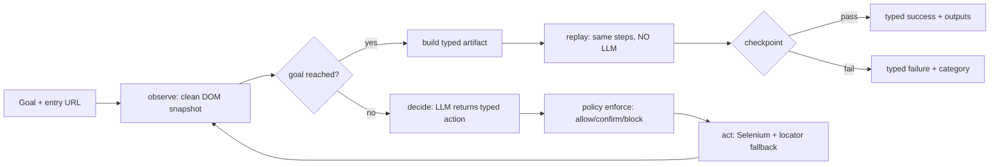

## Architecture

The system is a vertical slice split into five layers, each with one job and one source of truth:

| Layer | Module | Responsibility | Source of truth |
|-------|--------|----------------|-----------------|
| Target surface | `src/proxy_app/` (Flask, "MemberServ Console") | Deliberately realistic legacy banking UI: multi-step flow, server-side validation, business outcomes | Deterministic in-memory seed data |
| Typed contract | `artifact/` (Pydantic models) | Serializable, versioned hand-off between discovery and replay | `artifact/models.py` -> derived `docs/schemas/artifact.schema.json` (anti-drift test) |
| Safety core | `safety/` (policy + redaction engine) | Perimeter allowlists, action classification, write-time masking | `config/policy.json` |
| Discovery (LLM here only) | `discovery/` (`observe -> decide -> act` loop) | Compiles a natural-language goal into a typed artifact | `DiscoveryConfig` + local Ollama `qwen2.5-coder:7b` |
| Replay (no LLM anywhere) | `replay/` (engine, taxonomy, handoff) | Deterministic re-execution, typed failures, human escalation | `config/taxonomy.json` |

Toolchain: Python 3.11+, `uv` (locked dependencies), Flask, Selenium 4 (Chrome via Selenium Manager), Pydantic 2, `ollama` client, pytest/ruff/mypy/bandit. One CLI entry point (`computer-use-automation-system`) exposes the two modes of trust: `discover` may improvise (LLM); `replay` never does (enforced by a static import test over `replay/`).



**Data flow.** Discovery reads the DOM (never screenshots - the model is text-only), asks the LLM for one strictly typed action per step, runs it through the same policy gate replay uses, and records every step in a redacted JSONL log. When the goal verdict fires, the step sources are compiled into an `Artifact` and written to disk. Replay loads that file, validates inputs against `input_schema` before touching the browser, re-executes each step through the identical `enforce()` gate, and lets the mandatory checkpoint decide success. The artifact - not the conversation history that produced it - is the only thing that crosses the boundary.

**Control flow.** Both loops are plain synchronous Python: there is no queue, no worker pool and no database. The browser session is owned by exactly one of two controllers at any time (`ControlState = automation | human`), which is what makes the Phase 8 handoff possible without restarting the session.

**Configuration over code.** Policy, redaction patterns and failure-classification patterns are JSON files (`config/policy.json`, `config/taxonomy.json`), strictly validated at startup (`extra="forbid"`); an operator retunes guardrails or the error vocabulary without a code change, and a broken file fails closed (exit `2`) before any browser call.

**Exit-code contract.** The CLI reports outcomes through a small, documented set of codes (full table under *Determinism & error handling*), never through tracebacks: config problems exit `2`, infrastructure errors exit `1` with a single redacted line, and every run status has its own code so callers can branch without parsing text.

Key trade-offs:

- **Local, text-only LLM.** `qwen2.5-coder:7b` via Ollama costs no API budget and keeps runs offline; being text-only forces observe to emit a clean DOM/accessibility snapshot instead of screenshots, which also keeps prompts small and logs reviewable. The cost is a weaker planner: live runs need a precise goal statement (URL + element names) and a step/time budget.
- **One CLI, two modes of trust.** `discover` may improvise (LLM); `replay` never does (enforced by a static import test over `replay/`). The artifact is the hand-off point between the two.
- **Config over code.** Policy, redaction patterns and failure patterns are JSON files, so an operator retunes guardrails or error vocabulary without a code change.
- **Tests use fakes, evidence uses live runs.** The suite (474 tests) injects a fake LLM and fake driver; `/evidence/` is produced only by real Chrome + Ollama + the proxy app.

## Artifact schema

The artifact is a serializable, versioned (`semver`), typed JSON contract that fully decouples the discovered flow from the LLM history that produced it. Pydantic models are the source of truth; the exported JSON Schema is derived and guarded by an anti-drift test.

- **Identity and intent**: `capability_id` (snake_case), `version`, `description`, `target_app` (`name` + `entry_url`), so a reviewer or calling agent understands the capability from the file alone (see `evidence/artifact_example.json`).
- **Typed IO**: `input_schema` / `output_schema` are constrained JSON-Schema object subsets; cross-invariants are validated on the whole artifact (every `{{input.X}}` declared, every `extract.output_key` declared, `step_id` strictly `1..n`), so drift fails at load time, not at run time.
- **Steps with prioritized locators**: every step carries an ordered `locators` array (`id` -> `css` -> `role` -> `xpath` -> `text`); order is fallback priority, which is the primary defense against small UI variations. `type`/`select` values must be parametrized (`{{input.*}}`); run values never get hardcoded.
- **Mandatory checkpoint**: success is gated by an explicit condition (`visible` / `text_present` / `url_contains`), never by "no exception was raised". Discovery emits a `url_contains` checkpoint on the **area prefix** of the final URL (scheme + host + first path segment) when the goal path yields one: stable across runs and member IDs because run-specific values (ids deeper in the path, query strings) are stripped at build time; otherwise it falls back to `visible`/`body`. The dedicated `url` locator type is checkpoint-only and can never be resolved as an element selector, so a checkpoint expectation cannot leak into the step chain.
- **Strictness**: `extra="forbid"` everywhere, so unknown keys and schema drift are rejected loudly.

### Field reference

| Model | Key fields | Rules |
|-------|-----------|-------|
| `Artifact` | `capability_id`, `version`, `description`, `target_app`, `input_schema`, `output_schema`, `steps`, `checkpoint` | `capability_id` matches `^[a-z][a-z0-9_]*$`; `version` is semver `X.Y.Z`; `steps` >= 1; checkpoint mandatory; no extra fields |
| `TargetApp` | `name`, `entry_url` | `entry_url` must be `http(s)://` |
| `Step` | `step_id`, `action_type`, `description`, `locators`, `value`, `output_key`, `timeout_ms` | `step_id` sequential from 1; `action_type` in `navigate`/`click`/`type`/`extract`/`select`; `timeout_ms` > 0 (default 5000) |
| `Locator` | `type`, `value` | `type` in `id`/`css`/`xpath`/`role`/`text`; **array order = fallback priority** (a list to try in order, not a set to pick from) |
| `Checkpoint` | `description`, `locators`, `expected_condition` | `visible` / `text_present` / `url_contains` |
| `JSONSchemaObject` | `type`, `properties`, `required` | `type` fixed `"object"`; `required` is a subset of `properties` |

Cross-invariants (checked on the whole artifact, so drift fails validation early): every `{{input.X}}` is declared in `input_schema.properties`; every `extract.output_key` is declared in `output_schema.properties`; `output_key` appears only on `extract` steps; `step_id` is exactly `1..n`; `navigate` values are `http(s)` URLs; `click`/`extract` declare no `value`.

Minimal shape:

```json
{
  "capability_id": "the_input_field_named_new_loan_disbursement_is_visible_on_th",
  "version": "1.0.0",
  "target_app": {"name": "127.0.0.1:5000", "entry_url": "http://127.0.0.1:5000/"},
  "input_schema": {"type": "object", "properties": {"q": {"type": "string"}}, "required": ["q"]},
  "steps": [
    {"step_id": 1, "action_type": "navigate", "locators": [{"type": "css", "value": "body"}],
     "value": "http://127.0.0.1:5000/", "timeout_ms": 5000},
    {"step_id": 2, "action_type": "type",
     "locators": [{"type": "id", "value": "q"}, {"type": "css", "value": "input#q"}],
     "value": "{{input.q}}", "timeout_ms": 5000}
  ],
  "checkpoint": {"description": "...", "expected_condition": "url_contains",
                 "locators": [{"type": "url", "value": "http://127.0.0.1:5000/members"}]}
}
```

## Determinism & error handling

Replay is a pure interpreter: inputs are validated against `input_schema` before the browser is touched, `{{input.*}}` is resolved, every action passes the same policy `enforce()` used at discovery, locators fall back in order under explicit `WebDriverWait` (a static test forbids `time.sleep()`), and the checkpoint gates the typed result. No LLM, no network beyond the target app, deterministic outputs.

**Determinism guarantees (each one is a test):** replay never imports LLM modules (static import test); waits are explicit `WebDriverWait` only; locator resolution is ordered and first-match-wins; classification precedence is fixed; the same inputs + same UI produce the same `ReplayResult` (determinism test over a fake driver); timestamps are deliberately absent from logs so runs diff cleanly.

UI drift is absorbed in two places that require no re-recording: each step resolves through an ordered multi-strategy locator chain (renamed ids, different nesting -> reorder, not rediscover), and application message drift is reclassified by editing `config/taxonomy.json` patterns instead of touching code.

Failures are first-class, classified deterministically from the driver outcome plus observable page text with a **config-driven taxonomy** (`config/taxonomy.json`):

| Category | Meaning | Example from evidence | What the operator does |
|----------|---------|------------------------|------------------------|
| `business_outcome` | The app answered normally and the answer *is* the result | `evidence/replay_exception.log`: replaying with `q=M-9999` ends in `element_not_found`, reclassified as *"page pattern: No records found"*, exit `1` | Nothing - not a system failure |
| `recoverable` | Transient condition (stale node, slow load, known dialog); retried up to `max_recoverable_attempts` (default 3), then escalated | stale element on a re-rendered table | Re-run later |
| `hard` | Real failure; the run stops and reports stage, step and context | element never appears, driver crash | Inspect `stage`, `step`, `message` |

- **Precedence is fixed and tested**: business pattern > unknown dialog > explicit hard pattern > recoverable code/pattern > hard by default. Classification is re-evaluated on every retry attempt; a known dialog is dismissed once per attempt, always through `enforce()`.
- **Fail closed on config**: the CLI validates `config/taxonomy.json` before doing anything else - a broken file exits `2` with a clear message instead of crashing mid-run.
- **Safety of the message itself**: failure strings built from page state pass the redaction layer before they are stored or printed; CLI failures are typed `ReplayResult.error` objects (`stage` in `input_validation` / `step` / `policy` / `checkpoint` / `output_validation`), never raw exceptions.

**Exit codes** (the full contract, both subcommands):

| Code | `discover` | `replay` |
|------|-----------|----------|
| `0` | `goal_reached` - artifact emitted | `success` - checkpoint passed, outputs validated |
| `1` | generic failure (unexpected infrastructure error, redacted one-liner) | any typed failure (input validation, step, checkpoint, output validation) |
| `2` | usage error, invalid config, artifact/log outside the working tree | usage error, unreadable/invalid artifact, invalid config/taxonomy |
| `10` | `blocked` - policy perimeter stopped the run | `blocked` - policy refused an action |
| `11` | `needs_approval` | `needs_approval` (also an `abort` decision at an approval pause) |
| `12` | `max_steps` - step budget exhausted | - |
| `13` | `timeout` - global time budget exhausted | - |
| `14` | `dead_end` - repeated identical states, no progress | - |
| `15` | `llm_error` - Ollama unreachable/invalid replies after feedback retries | - |
| `130` | - | interrupted with Ctrl+C (message on stderr, no stack trace) |

Evidence: `evidence/replay_run.log` is a full success timeline (policy decisions, steps, checkpoint, result); `evidence/replay_exception.log` is a managed failure replayed with a member ID that does not exist (`M-9999`): step 4 clicks "View Detail", which the results page does not offer, and the classifier derives `business_outcome` from the page pattern "No records found" (exit 1, `failure` + `result` events in the log).

## Heterogeneity & multi-tenant

Design-level only - no queues, clusters or databases are introduced (explicitly out of scope).

**Surface heterogeneity.** The browser boundary is a small `BrowserDriver` protocol; everything above it (loop, artifact, replay, policy, taxonomy) is backend-agnostic:

| Protocol method | Purpose | Selenium today |
|-----------------|---------|----------------|
| `navigate(url)` | Load a page; refuses non-`http(s)` schemes (defense in depth) | `driver.get` + `document.readyState` wait |
| `observe_raw()` | Clean DOM/accessibility element list for observe/checkpoint | injected JS serializer |
| `current_url()` | Perimeter checks and checkpoints | `driver.current_url` |
| `click(ref)` / `type_text(ref, value)` / `select_option(ref, value)` | Act with `WebDriverWait` around staleness | Selenium actions |
| `extract_text(...)` | Read page text for failure classification | page source |
| `quit()` | Session teardown | `driver.quit()` |
| `screenshot_b64()` / `page_text()` (optional) | Evidence image / static-message observation | present on the real driver, absent on fakes |

A desktop app or a frameset-heavy legacy webapp would implement the same protocol with, e.g., a CDP accessibility-tree backend or a UI-automation API, without touching the loop, artifact or replay code.

**Locator resilience across variants**: each step already resolves through an ordered multi-strategy fallback chain, so tenant-specific markup variants (renamed ids, different nesting) are absorbed by re-ordering locators rather than re-recording the flow.

**Multi-tenant reuse**: the artifact targets `target_app.entry_url` and parametrized inputs, not a specific tenant instance. Reuse across institutions that share one base application means: same artifact, different `entry_url` + input set + policy file. Per-tenant variation is configuration, which is exactly how the repo already separates concerns:

| Concern | Per-tenant knob |
|---------|-----------------|
| Which instance to drive | artifact `target_app.entry_url` / `--entry` |
| What it may touch | `config/policy.json` (`allowed_origins`, `allowed_routes`) |
| Which messages mean what | `config/taxonomy.json` patterns |
| Seed/scenario data | proxy app seed (or the real tenant's UI) |
| Operator approval rules | `config/policy.json` `rules` (`confirm` / `flag` / `block`) |

What is *not* built: a catalog of capabilities, cross-tenant routing or a demo running two tenants - those need the production infrastructure this take-home deliberately skips.

## Escalation & handoff

Blocked runs pause instead of dying, and the human takes over **the same live session**:

- **Triggers** (closed set): `hard_failure`, `retries_exhausted`, `needs_approval`, `risky_step`. A policy `block` never escalates - it stops the action outright. Both approval triggers pause at the policy stage: `needs_approval` fires when `enforce()` rejects an action that needs approval and none was granted; `risky_step` is the pre-emptive variant that pauses *before* the action runs, announcing an upcoming `confirm`-verdict step (e.g. `*/execute`).
- **Package**: the pause emits a redacted context package (trigger, stage, step, action, reason, capability id/version, observed-element count, bounded snapshot, optional screenshot) so the operator can act without reading code. Text fields are capped at 2000 chars and snapshots at 100 elements (`MAX_HANDOFF_TEXT` / `MAX_SNAPSHOT_ELEMENTS`), truncated at capture time *after* redaction.
- **Control transfer**: a `ControlState` flag flips `automation -> human` while the driver stays alive; the engine makes *zero* driver calls while paused (asserted by test), the operator manipulates the same browser, then returns `resume` / `finish` / `abort`. No session restart - the known anti-pattern.
- **Semantics**: `resume` retries the step (approval is granted for that step only), `finish` skips the rest but still gates on the checkpoint (no false success), `abort` converts to a typed failure (exit `11` for approval aborts, `1` otherwise). Invalid input or EOF maps to `abort` - approval is never assumed. At most one handoff per step, so there are no pause loops.
- **Evidence**: every intervention is recorded as a `HandoffRecord` (request, decision, note, resumed snapshot) inside `ReplayResult.handoff`, and `--log-out` writes those events to the replay log - `evidence/handoff_run.log` is a live pause (`trigger=risky_step` on the `*/execute` step), operator decision `resume`, `checkpoint: passed` and `result: success` over the same session.

```text
automation --trigger--> PAUSE (context package) --human acts on same session-->
   resume  -> retry step with automation control
   finish  -> skip rest, checkpoint still decides success
   abort   -> typed failure (exit 11/1)
```

| Decision | Browser | Steps | Final gate | Exit |
|----------|---------|-------|-----------|------|
| `resume` | same session | retry current step, continue | checkpoint | `0` if the run completes |
| `finish` | same session | skip remaining steps | checkpoint alone (never auto-success) | `0` / `1` |
| `abort` | same session | stop now | typed failure at the trigger stage | `11` (approval) / `1` |
| EOF / invalid input | same session | treated as `abort` | approval is never assumed | `11` / `1` |

Without `--interactive`, behavior is byte-for-byte Phases 6/7 (`operator=None`) and exit codes are unchanged: a needed approval surfaces as exit `11` instead of a pause.

## Safety

Guardrails are deterministic code plus configuration, never LLM judgment. Threat model: a prompt-injected or hallucinating LLM (discovery) or a tampered artifact (replay) must not be able to leave the target app, trigger irreversible actions, or leak regulated data into logs.

- **Perimeter first**: `allowed_origins` / `allowed_routes` / `allowed_action_types` are checked before anything else; scheme-relative URLs (`//evil.example`) are rejected, path traversal (`..`, `%2e%2e`) is normalized before the route allowlist, non-`http(s)` schemes never reach the browser, and a `block` can never be overridden by a rule.
- **Classification**: ordered rules (first match wins) mark `*/execute` as `confirm` (irreversible financial actions need explicit `approved=True`) and `extract` as `flag` (audit mark); every rule carries a mandatory human-readable `reason`. Discovery and replay both call the same `enforce()` gate on every action.
- **Write-time redaction**: masking happens at the writer layer - both `StepLogger` and `ReplayLogger` redact before bytes hit disk; CR/LF are escaped (no log forging) and `safe_write_text` contains writes inside a base directory (`--artifact-out` outside the working tree is refused with exit `2`).

| Redaction rule | Matches | Result (live-verified) |
|----------------|---------|------------------------|
| `secret_assignment` | `password = ...`, `api_key = ...` | `[REDACTED_SECRET]` |
| `account_number` | `CHK-2201` | `CHK-****01` |
| `money_amount` | `4250.75` | `[REDACTED_AMOUNT]` |
| name literals | `Alice Hartwell`, `Brian Okafor`, `Carla Mendes` | `[REDACTED_NAME]` |
| `field_keys` | `account_id`, `balance`, `amount`, `full_name`, ... | value masked, structure preserved |

- **Repo hygiene**: no secrets are committed (`.env` is gitignored; `.env.example` has placeholders), evidence uses synthetic seed data only, and CI runs three independent gates:

| Gate | Tool | Scope |
|------|------|-------|
| SAST | `bandit -r src/ -ll` (+ `ruff --select=S`) | Python security lints |
| Dependencies | `pip-audit --strict` over the pinned `uv.lock` export | runtime + dev dependencies |
| Secrets | `detect-secrets` fresh scan diffed against the committed `.secrets.baseline` | every tracked file; new findings fail the job with `::error` annotations |

- **Audit trail**: six audits live in `docs/security/` (phases 4, 5, 7, 8, release 2026-10-01 and the 2026-10-05 remediation delta) with a consolidated catalog in `docs/security/README.md`. The release gate reports **0 Critical/High/Medium open**; the remediation delta closed `SEC-503` (URL-scheme guard), `SEC-505` (output-write containment), `SEC-805` (handoff size caps), `DEF-803` (narrowed exception handling) and `SEC-901` (the CI secret-scanning job can now actually fail).

## Cuts

Deliberate scope reductions, in priority order for a follow-up:

| # | Cut | Why it was cut | Follow-up effort |
|---|-----|----------------|------------------|
| 1 | **Stretch goals - none implemented** (capability catalog, code generation, confidence/approval scoring, assisted locator fallback, multi-tenant demo, stability signal) | Decision taken up front; the vertical slice was the priority | Documented per assignment; start only if the reviewer asks |
| 2 | **Co-browsing console** | Handoff uses a stubbed stdin operator; the control-transfer model is real, the operator UI is not | Small-to-medium: web terminal over the live session |
| 3 | **Checkpoint live failure coverage** | The exception replay fails at the click step, so checkpoint-*failure* paths are exercised in tests rather than in committed live evidence | Small: one artifact whose checkpoint targets a missing state |
| 4 | **Discovery robustness with small models** | Live runs show `qwen2.5-coder:7b` needs precise goals and can approve a goal early; mitigations budgeted (step/time budgets, dead-end detection) but no planner improvements | Medium: few-shot prompt bank or a planner model |
| 5 | **Output extraction end-to-end live** | `output_schema` and `extract` steps are implemented and tested, but the example artifact exercises no extraction | Small: a balance-lookup artifact with `extract` + `output_schema` |
| 6 | **Persistence and scale** | Out of scope: no database, queue or service layer - one process, one session, config files; timestamps are intentionally absent from logs (determinism) | Only if this becomes a service |

Priority next steps: (5) a live extraction example, (3) a live checkpoint-failure replay, (1) only if the reviewer asks.
